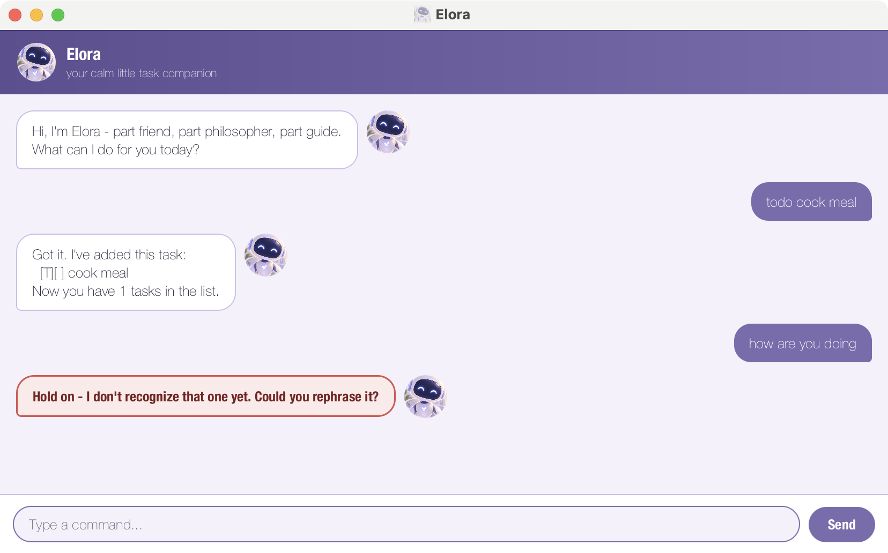

# Elora User Guide

Elora is a friendly little desktop chatbot for keeping track of your todos, deadlines, and
events - part friend, part philosopher, part guide. Type what you need in plain commands, and
Elora keeps your list organized (and saved) for you.



## Quick start

1. Ensure you have Java 25 installed on your computer.
1. Download the latest `elora.jar` from the [releases page](https://github.com/nraisa0408/ip/releases).
1. Run it with `java -jar elora.jar`, or double-click it. A chat window titled "Elora" should appear.
1. Type a command into the box at the bottom and press Enter (or click **Send**). Try `todo read book` to get started.
1. Refer to the [Features](#features) below for the full list of things Elora can do.

Your tasks are saved automatically to `data/elora.txt` next to the jar file, so they're still
there the next time you open Elora.

## Features

> **Notes on the command format**
> - Words in `UPPER_CASE` are parameters you supply, e.g. in `todo DESCRIPTION`, `DESCRIPTION` is
>   the todo's description.
> - Dates must be written as `yyyy-mm-dd`, e.g. `2019-10-15`.
> - Task numbers refer to the position shown by `list` (starting from 1).
> - If a command is missing something it needs, badly formatted, or would create an exact
>   duplicate of an existing task, Elora tells you what's wrong instead of guessing - error
>   replies show up in a red-outlined bubble so they're easy to spot.

### Adding a todo: `todo`

Adds a simple task with no date attached.

Example: `todo read book`

```
Got it. I've added this task:
  [T][ ] read book
Now you have 1 tasks in the list.
```

### Adding a deadline: `deadline`

Adds a task that needs to be done by a specific date.

Format: `deadline DESCRIPTION /by yyyy-mm-dd`

Example: `deadline return book /by 2019-10-15`

```
Got it. I've added this task:
  [D][ ] return book (by: Oct 15 2019)
Now you have 2 tasks in the list.
```

### Adding an event: `event`

Adds a task that spans a start and an end.

Format: `event DESCRIPTION /from START /to END`

Example: `event team meeting /from Mon 2pm /to 4pm`

```
Got it. I've added this task:
  [E][ ] team meeting (from: Mon 2pm to: 4pm)
Now you have 3 tasks in the list.
```

If both `START` and `END` happen to be `yyyy-mm-dd` dates, Elora also checks that the event
doesn't end before (or at the same time as) it starts, and rejects a date that's the right
shape but doesn't exist (e.g. `2029-01-32`). When `START` and `END` are dates, the event also
takes part in `on` and `sort` below, using `START` as its sort date and `[START, END]` as the
range of dates it's considered to occur on. Events with free-text times (e.g. `Mon 2pm`) are
left out of both, since they have no date Elora can compare.

### Listing all tasks: `list`

Shows every task currently on your list, numbered from 1.

Example: `list`

### Marking a task as done: `mark`

Format: `mark INDEX`

Example: `mark 2`

### Marking a task as not done: `unmark`

Format: `unmark INDEX`

Example: `unmark 2`

### Deleting a task: `delete`

Removes a task from the list permanently.

Format: `delete INDEX`

Example: `delete 2`

### Finding tasks: `find`

Shows every task whose description contains the given keyword (case-insensitive).

Format: `find KEYWORD`

Example: `find book`

### Viewing tasks on a date: `on`

Shows every deadline due on the given date, and every date-ranged event (see [Adding an
event](#adding-an-event-event)) whose `[START, END]` range includes it.

Format: `on yyyy-mm-dd`

Example: `on 2019-10-15`

### Sorting tasks by date: `sort`

Sorts your list so tasks with a date (deadlines by their due date, date-ranged events by their
start date) come first, soonest first; everything else (todos, and events with free-text
times) keeps its original order at the end.

Example: `sort`

### Exiting: `bye`

Ends the chat (and, in the console version, the program).

Example: `bye`

## Command summary

| Action | Format | Example |
|---|---|---|
| Todo | `todo DESCRIPTION` | `todo read book` |
| Deadline | `deadline DESCRIPTION /by yyyy-mm-dd` | `deadline return book /by 2019-10-15` |
| Event | `event DESCRIPTION /from START /to END` | `event meeting /from Mon 2pm /to 4pm` |
| List | `list` | `list` |
| Mark | `mark INDEX` | `mark 2` |
| Unmark | `unmark INDEX` | `unmark 2` |
| Delete | `delete INDEX` | `delete 2` |
| Find | `find KEYWORD` | `find book` |
| On | `on yyyy-mm-dd` | `on 2019-10-15` |
| Sort | `sort` | `sort` |
| Bye | `bye` | `bye` |

## Acknowledgements

This project was built with the assistance of [Claude Code](https://claude.com/claude-code), used
throughout development for the GUI redesign, error handling, and automated tests. See the
project [README](https://github.com/nraisa0408/ip#acknowledgements) for full acknowledgements.
